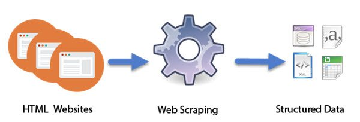

<!-- Add banner here -->

# Web Scraping with AWS serverless
<!-- Add buttons here -->

<!-- Describe your project in brief -->
In this project, we implement the web scraper with AWS lambda
to fetch the job posting data from `monster.com`.

# Table of contents
- [Description](#Description)
- [Conclusion](#Conclusion)

## Description
We implement the web scraper with AWS serverless to fetch the job posting data from `monster.com`
and store the structural data into database.

We use AWS lambda (i.e., Serverless Compute Service) to run the code and 
Amazon DynamoDB (i.e., fully managed proprietary NoSQL database service)
to store structural data.

## Conclusion
In this project, we implemented web scraper with AWS serverless to 
to fetch the job posting data from `monster.com`.

